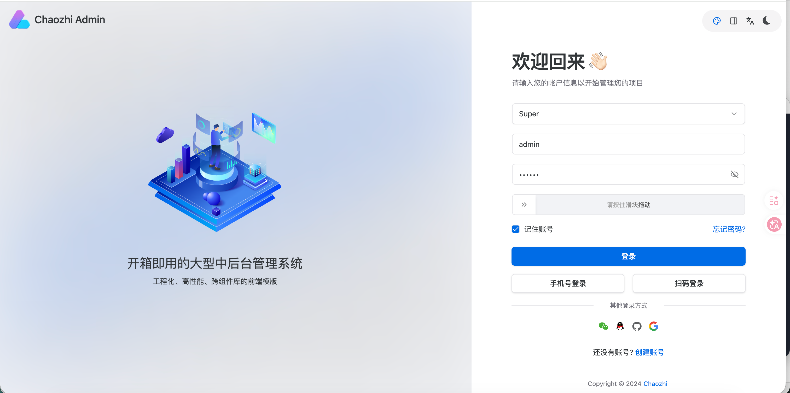
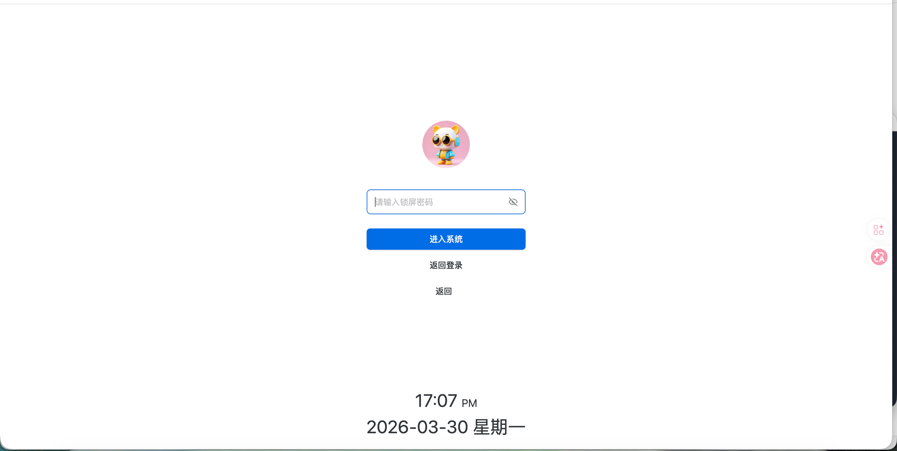
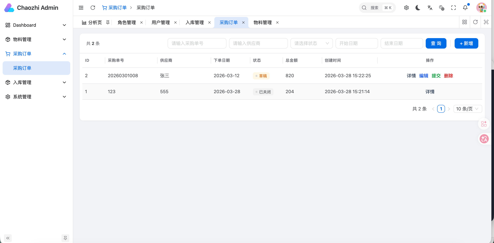

# Chaozhi Admin

AI-first full-stack admin scaffolding for generating Spring Boot + Vue business modules from Markdown requirements.

Chaozhi Admin is built for full-stack developers who do not want to keep rebuilding the same CRUD, status flow, permission, and API glue by hand.  
You describe a business module in Markdown, and the project conventions drive AI to generate backend and frontend code together.

## Why Chaozhi Admin

Most admin templates solve only one layer:

- some are frontend page starters
- some are backend scaffolds
- some provide components but no business delivery workflow

Chaozhi Admin is aimed at a different target:

- full-stack module generation, not only page generation
- Markdown requirement driven, not chat history driven
- repository rules are explicit through `CLAUDE.md`
- API, auth, permissions, and status flow conventions are fixed up front
- output is expected to be runnable business code, not demo-only mock code

## What You Can Generate

With one system overview doc plus one module requirement doc, the default target is:

- backend controller / service / mapper / entity / DTO / VO
- frontend API / route / page / i18n
- page permissions / button permissions / interface permissions
- CRUD pages and business forms
- submit / approve / confirm / cancel style action endpoints
- source-document linkage such as purchase order -> stock-in order

## Core Conventions

These rules are fixed so AI output stays stable:

- Success response: `{ code: 0, data: ... }`
- Authentication: `token + Redis session + Authorization header`
- New backend interfaces require login by default
- Action endpoints use `PUT /{module}/{id}/{action}` by default
- Source document lookup uses `GET /{source-module}/detail-by-no?orderNo=xxx`
- New frontend modules connect to real backend APIs by default
- New modules default to permission access control

## Project Structure

```text
chaozhi-admin/
├── chaozhi-backend/     Spring Boot backend scaffold
├── chaozhi-web/         Vue 3 + Vite + Ant Design Vue admin frontend
├── CLAUDE.md            Repository-level AI generation rules
└── demo/                System overview, permission spec, SQL, module prompt examples
```

## How The Workflow Looks

1. Write `系统总览.md` to define the business domain and module boundaries.
2. Write a module requirement doc such as `入库管理.md`.
3. Let AI generate code under the repository rules in:
   - `CLAUDE.md`
   - `chaozhi-backend/CLAUDE.md`
   - `chaozhi-web/CLAUDE.md`
4. Run the generated backend and frontend directly against real APIs.

## Screenshots

### Login Page



### Lock Screen



### Purchase Order



## Demo Assets

The repository already contains a working documentation demo under `demo/`:

- `系统总览.md`
- `权限体系规范.md`
- `模块提示词示例/物料.md`
- `模块提示词示例/采购订单.md`
- `模块提示词示例/入库管理.md`
- `模块提示词示例/库存管理.md`
- `模块提示词示例/库存流水.md`
- `模块提示词示例/销售出库.md`
- `chaozhi.sql`

These files are not filler docs. They are the prompt and requirement assets used to drive module generation consistently.

## Tech Stack

- Backend: Spring Boot, MyBatis-Plus, Redis
- Frontend: Vue 3, TypeScript, Vite, Ant Design Vue, Pinia, vue-router
- Collaboration model: `CLAUDE.md` + Markdown business docs

## Quick Start

### Backend

```bash
cd chaozhi-backend
mvn spring-boot:run
```

### Frontend

```bash
cd chaozhi-web
pnpm install
pnpm dev
```

Default local addresses:

- Frontend: `http://localhost:5666`
- Backend: `http://localhost:8080`

## Why It Can Get Better Over Time

The value of this repository is not only the scaffold itself. It is the combination of:

- stable engineering rules
- reusable Markdown requirement templates
- reusable system overview docs
- reusable permission conventions
- reusable full-stack module examples

That means each new module can improve the next one instead of starting from zero.

## Current Status

This repository is in the early public stage and is focused on proving one thing well:

AI-driven full-stack business module generation for admin systems.

Current notes:

- part of the backend package name still uses placeholder naming like `com.xxx.xxx`
- the workflow and demos are already usable
- the repository will continue to improve around module generation quality and business delivery speed

## Roadmap

- Improve repository homepage and public demo assets
- Add more complete module examples
- Polish default permission integration
- Improve generated page quality and CRUD interaction details
- Provide better release assets and onboarding docs

## License

This project is released under the MIT License. See [LICENSE](./LICENSE).
